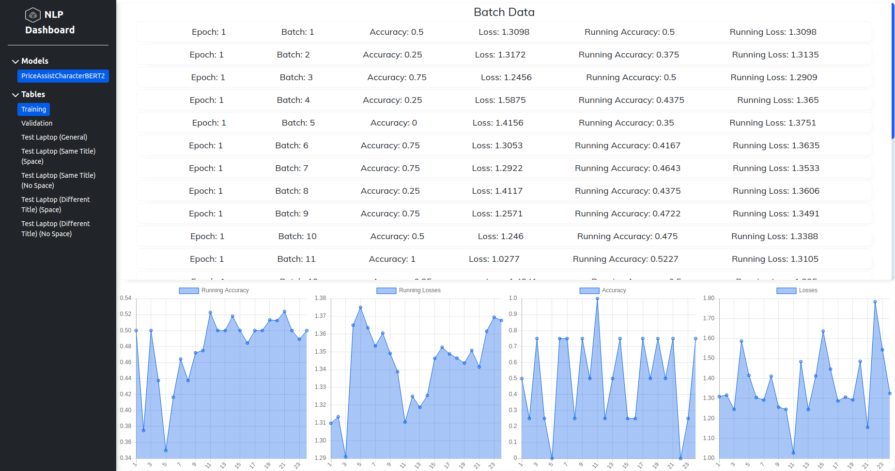

# NLP Dashboard

This project was made in order to easily see training examples when training a text-based classifier. 

## Features
* Able to see the accuracy, loss, running accuracy, and running loss for each batch.
* Able to see each example within a batch to see exactly what the model got right and wrong.
* Graphs that show the accuracy, loss, running accuracy, and running loss.
   * Note: The accuracy and loss graphs are fairly noisey, so the running statistics are better suited for seeing the trends of the model training.

## Future Improvements
* Ability to switch between what models to see.
* Make inferences to each different model.
* Search models from the database to add them to the front-end
   * Would also need a persistent method of storing models that have been saved.
* Visualize the attention module with a transformer (if the model being visualized uses a transformer)
